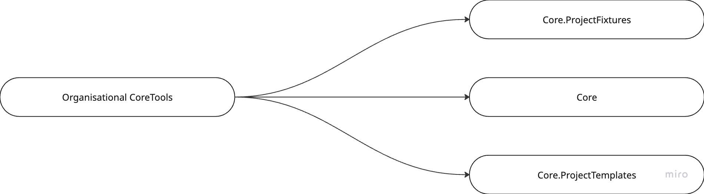
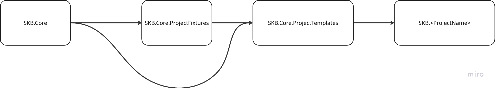

Maintaining a consistent and standardized approach to software development is crucial for any organization that aims for scalability, quality, and compliance. Two vital aspects of this consistency are **Core.Tools** and **ProjectTemplates**, which help enforce best practices, streamline onboarding, and reduce technical debt across teams.

---

### **Importance of Organisation-Wide Core.Tools**

**Core.Tools** refers to a curated set of development tools and configurations that are centrally maintained and used across all projects within the organization. These may include linters, formatters, static analyzers, version managers, code signing utilities, and shared scripts.

**Key Benefits:**

- **Quality Assurance**: Standardized linting and formatting rules ensure code adheres to quality guidelines, reducing bugs and promoting readability.
- **Security & Compliance**: Using the right version of tools (e.g., a vetted `LICENSE` file, secure package managers, etc.) ensures compliance with legal, open-source, and security policies.
- **Productivity & Onboarding**: Developers can hit the ground running without needing to manually configure their environments, speeding up project setup and reducing errors.
- **Cross-Team Consistency**: Teams can collaborate more effectively when everyone uses the same toolset and standards.

---

### **Importance of Organisation-Wide ProjectTemplates**

**ProjectTemplates** are boilerplate project structures or starter kits that come with predefined configurations, directory structures, testing setups, and best practices embedded from the start.

**Key Benefits:**

- **Consistency Across Projects**: Every new service or module starts from a common baseline, reducing fragmentation and improving maintainability.
- **Reduced Setup Time**: Engineers don’t need to reinvent the wheel for each project; templates provide everything from CI/CD setup to default linting, testing, and deployment scripts.
- **Built-in Compliance**: Templates can include mandatory legal files (like LICENSE or CONTRIBUTING.md), security baselines, or access control integrations.
- **Better Governance**: Centralized updates to templates mean improvements or policy changes can be rolled out across teams more easily.

---

### Verdict

By institutionalizing **Core.Tools** and **ProjectTemplates**, organizations build a foundation of uniformity and control. These practices not only elevate code quality and ensure regulatory compliance but also enhance collaboration and developer efficiency at scale.

## Project Scope Tree

Following illustration depicts what should be referred to a core tool, as well as how the vocabulary is associated with the dependencies.

### Example: .NET Framework Setup

This shows how the vocabulary is shared within the .NET Framwork Project Scope

